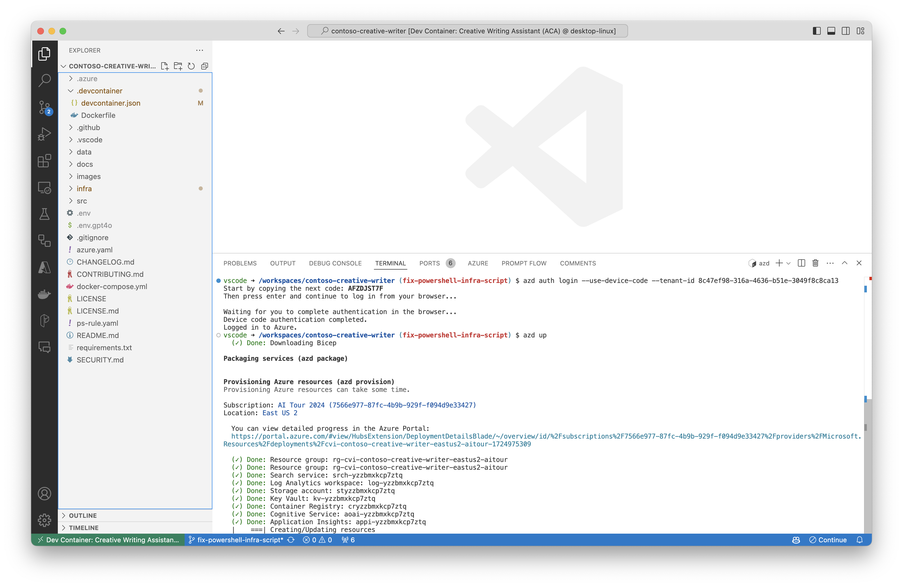
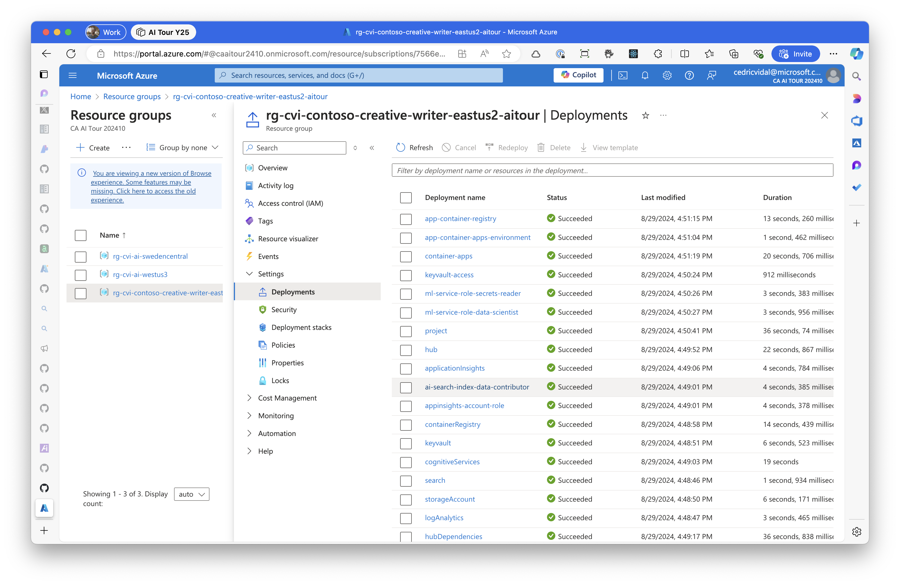
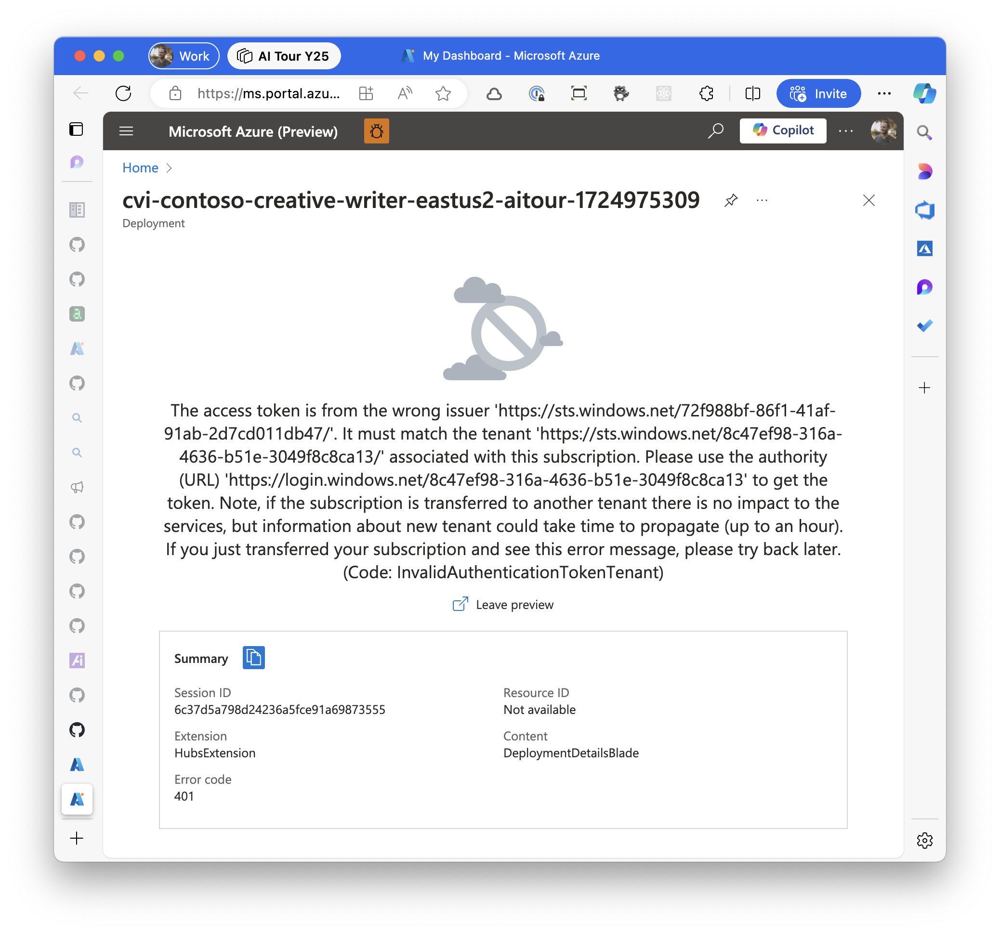
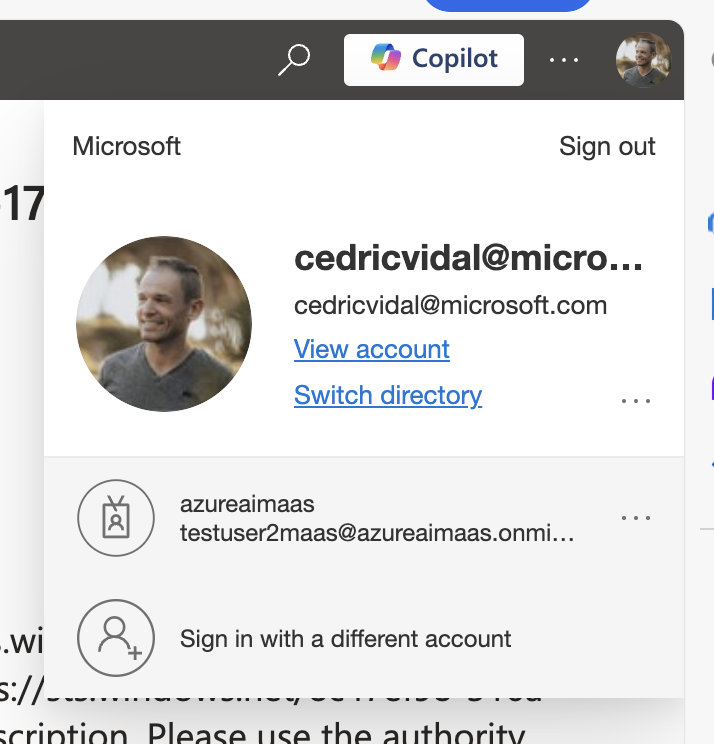
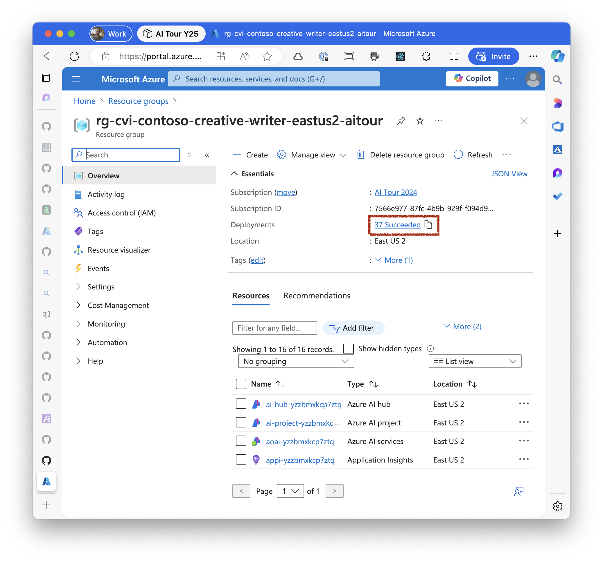
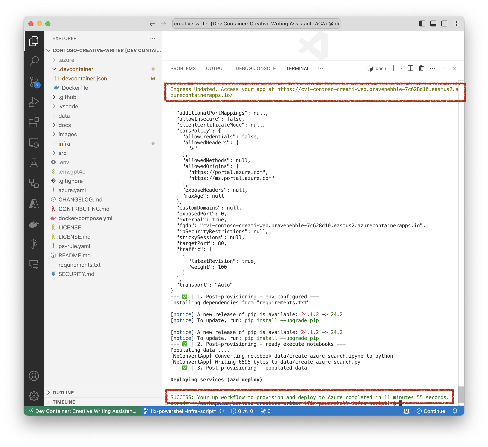
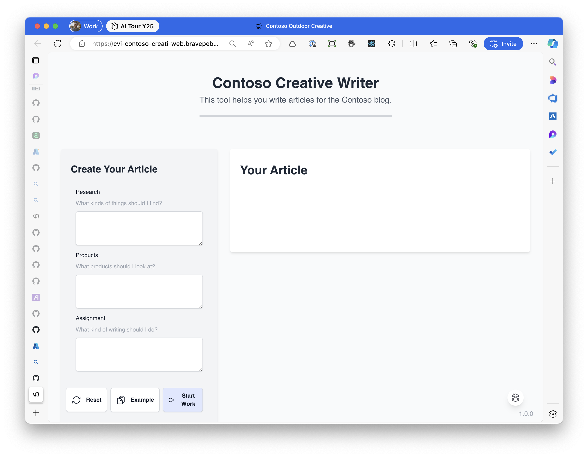
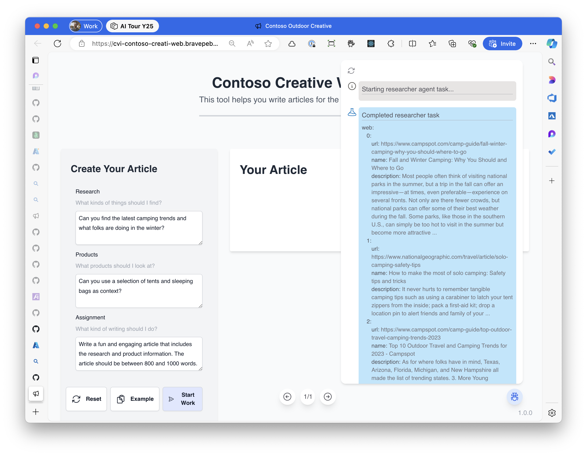

# Deploying the contoso-creative-writer demo

## How-to video

This how-to complements the [Azure Deployment video recording](https://microsoft-my.sharepoint.com/:v:/p/cedricvidal/EW88E0K68f5Fgx-wdie6szQBeDYRiS7WSt-POKzwJ5TuOQ?e=GMhsNh).

## Opening the project

To open the project in GitHub Codespaces, simply follow these steps:

1. Navigate to the GitHub project page: https://github.com/azure-Samples/contoso-creative-writer
2. Ensure you are logged in to your GitHub account.
3. On the repository page, locate and click the "Open in GitHub Codespaces" button.
4. If you don't see the button, you may alternatively click the green "Code" button and select "Open with Codespaces" from the dropdown menu.
5. If necessary, create a new codespace by selecting "New codespace" from the list of available codespaces.
6. GitHub will set up a codespace environment, which may take a few moments. Once the environment is ready, an editor window will open, displaying the project files.
7. You can now start working on the project in the web-based Visual Studio Code editor provided by Codespaces.

For more detailed information, you can refer to the [GitHub Codespaces documentation](https://docs.github.com/en/codespaces).

## Authenticating

You need to authenticate using both the Azure CLI `az` and the Azure Developer CLI `azd`:

```
az login --use-device-code
```

Note that you may need to add the `--tenant` parameter to login to your specific BAMI tenant.

The `az` authentication is required because the `az` tool is used during post provisioning to build and deploy the `api` and the `web` ACA containers.

```
azd auth login --use-device-code
```

Note that you may need to add the `--tenant-id` (different than for `az`) parameter to login to your specific BAMI tenant.

## Provisioning

To provision the project with `azd` (Azure Developer CLI), at the root of the project, type the following:

```
azd up
```



<details>

<summary><b>Optional</b>: Follow deployment progress in Azure Portal</summary>

You can optionally click on the link under `You can view detailed progress in the Azure Portal:`, you'll be redirected to the following screen:



Note that if you're deploying to a BAMI tenant and are already logged in to a different tenant in Azure Portal, you may get the following error:



If you do, you need to switch to the BAMI directory in the top right menu



Then navigate to the resource group and click on the deployments link



</details>


The provisioning takes some time and if everything works correctly, you should see the following:



At the very bottom, it should display `SUCCESS` and if you scroll up a bit, you should see the URL at which the web ACA container has been deployed.

Click on the link, it should display the web app successfully deployed:



You can then start using the web app, click on the `Example` button then on the `Start Work` button then on the bug shaped debug button on the lower right of the screen, if everything works correctly, you should start to see some debug messages and eventually the final article.


